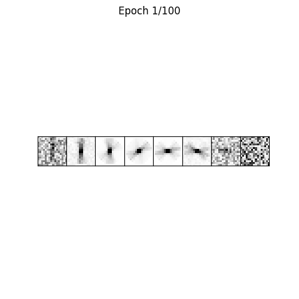
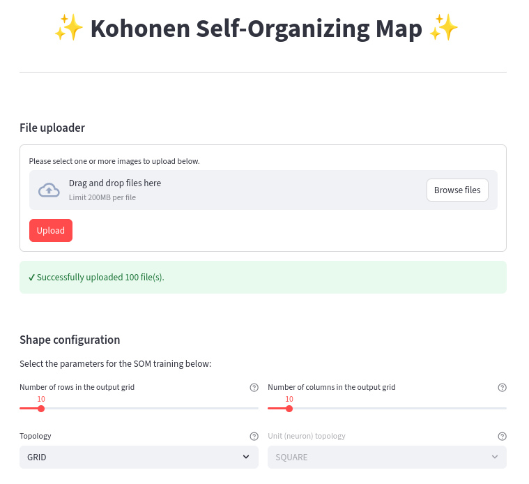
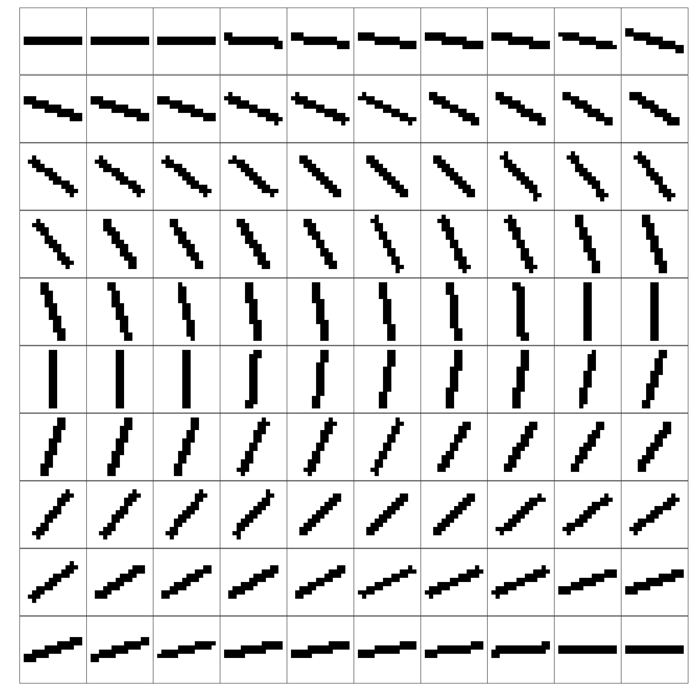

# Image2Map - A Kohonen Self-Organizing Map

This documentation is part of a software research project for the course of
[Neural Networks and Deep Learning](http://retis.sssup.it/~giorgio/courses/neural/nn.html),
lectured by Professor [Giorgio Buttazo](http://retis.sssup.it/~giorgio/)
from the University of Sant'Anna, Italy.

* **Project**: Image2Map

* **Lecturer**: Prof. Dr. Giorgio Buttazzo

* **Course**: Neural Networks and Deep Learning

* **Author**: Nelson Aloysio Reis de Almeida Passos


## About

The `image2map` package implements a Kohonen Self-Organizing Map (SOM), which is a type of
artificial neural network used for unsupervised learning. SOMs are particularly useful for
clustering and visualization tasks, as they preserve the topological properties of the input space
in the output space (i.e., the ''map''). This package is designed to work with image datasets,
and the goal is to organize them in a way that similar images are mapped to adjacent neurons
in the SOM grid.


### Install

The package supports **Python 3.7+** and may be installed using `pip`:

```bash
pip install .
```

For more information on using this package, please refer to the
documentation.


### Usage

This example demonstrates how to create a SOM, load a dataset of images, initialize the weights,
train the SOM, and visualize the results with the `SOM` class
from the `image2map` package:

```python
from image2map import SOM, utils

som = SOM(
    k_units=100,             # Number of units (neurons) in the SOM.
    k_shape=(10, 10),        # Shape of the output map.
    k_dist="l2",             # Distance among units ('l1', 'l2', 'chebyshev').
    n_inputs=None,           # Number of input features.
    n_shape=None,            # Shape of the input data.
    topology="grid",         # Topology of the SOM ('GRID', 'MESH', 'LINE', 'RING').
    unit_topology="square",  # Type of tiling for the SOM ('SQUARE', 'HEX').
    radius_max=None,         # Maximum radius for neighborhood function.
    radius_min=0,            # Minimum radius for neighborhood function.
    radius_rate=None,        # Decay function type ('exp', 'lin').
    radius_decay="exp",      # Decay rate (constant).
    alpha_max=0.1,           # Initial learning rate.
    alpha_min=0.01,          # Final learning rate.
    alpha_rate=None,         # Decay function type ('exp', 'lin').
    alpha_decay="exp",       # Decay rate (constant).
    phi="lap",               # Neighborhood function type ('lap', 'exp', 'sqd', 'lin').
    k=None,                  # Scaling for neighborhood phi='exp'.
    sigma=None,              # For neighborhood phi='lap'.
    seed=42                  # Random seed.
)

# Load folder with images.
X = utils.load_images("/path/to/input/images")
X_train, X_test = utils.split_ts(X, 0.8)

# Load MNIST dataset.
# X_train, y_train, X_test, y_test = utils.load_mnist("/path/to/input/mnist")

X_train = utils.minmax_scale(X_train, (-1, 1))
X_test = utils.minmax_scale(X_test, (-1, 1))

som.fit(X)
som.init_neurons()
som.init_weights(-1, 1)

som.train(X_train, epochs=100)
```

Once trained, the output map of the SOM may be visualized.
For example, below is an animation of the weights trained on the LINES dataset,
considering `k=8` units in a 1-dimensional topology:



### See also

- [Technical report](docs/assets/report.pdf) for an overview
  on the algorithm and the project's experimental results.

- [Jupyter notebook](notebook/image2map.ipynb) with code examples for training the SOM on this and other outputs.

_____


## Graphic User Interface

This package includes a Streamlit-based graphic user interface (GUI) as a proof of concept.

```bash
streamlit run run.py
```

Alternatively, to run it in a container, build the image with Docker first:

```bash
docker build -t image2map . && docker run -p 8501:8501 image2map
```

Then, open your web browser and navigate to [localhost:8501](http://localhost:8501) to access the GUI.



_____


### LINES dataset

One dataset used in this project was independently created and is composed of 100 images of
rotating lines with different angles. The images are stored in the `data` directory and are used
to train the SOM. The goal is to visualize how the SOM organizes these images based on their
similarities. Different image sets can be produced by using the ``generate_images.sh`` script
in the same folder.



_____

### License

This software is licensed under the [MIT License](https://opensource.org/license/mit/).
